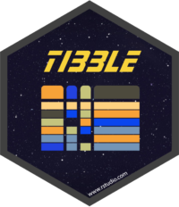

# Images repository for hex sticker images of the tidyverse and others

Here is a repository for the hex sticker images used in the `tidyverse`.

They are subject to change but are accurate as of July 2019.

 

--------

[Here is a YouTube Video](https://www.youtube.com/watch?v=iJspIB-Wh38)
